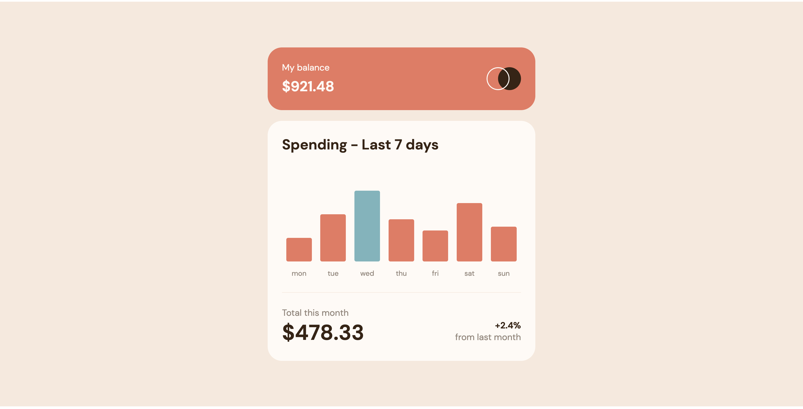
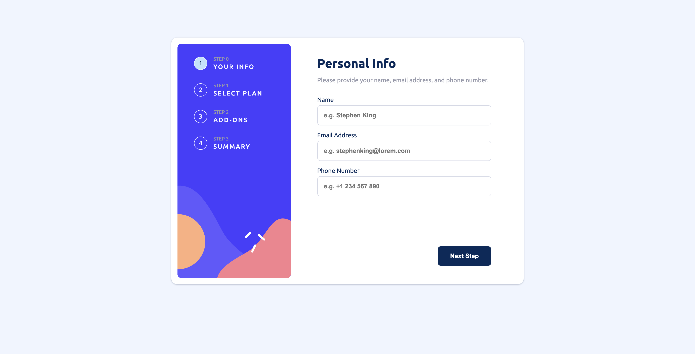

# Frontend Mentor - Challenges (Peter Farber)

## Table of contents

- [Overview](#overview)
  - [Screenshot](#screenshot)
  - [Links](#links)
- [My process](#my-process)
  <!-- - [What I learned](#what-i-learned) -->
  - [Useful resources](#useful-resources)
- [Author](#author)
- [Acknowledgments](#acknowledgments)

## Overview

### Screenshots

QR Code
Expenses Chart
Multi Step Form

### Links

- [QR Code](https://peterfarber.github.io/FrontendMentor-QR_Code/index.html?page=qr-code) | [Challenge](https://www.frontendmentor.io/challenges/qr-code-component-iux_sIO_H)
- [Expenses Chart](https://peterfarber.github.io/FrontendMentor-QR_Code/index.html?page=expenses-chart) | [Challenge](https://www.frontendmentor.io/challenges/expenses-chart-component-e7yJBUdjwt)
- [Multi Step Form](https://peterfarber.github.io/FrontendMentor-QR_Code/index.html?page=multi-step-form) | [Challenge](https://www.frontendmentor.io/challenges/multistep-form-YVAnSdqQBJ)

<!-- ### What I learned -->

### Useful resources

- [The Complete Guide to Centering in CSS](https://moderncss.dev/resource-the-complete-guide-to-centering-in-css/)
- [Accessible heading structure](https://www.a11yproject.com/posts/how-to-accessible-heading-structure/)

## Author

- Website - [Peter Farber](https://peterfarber.github.io/FrontendMentor-QR_Code/)
- Frontend Mentor - [@PeterFarber](https://www.frontendmentor.io/profile/PeterFarber)

## Acknowledgments

- Insightful Comment - [MelvinAguilar](https://www.frontendmentor.io/profile/MelvinAguilar)
